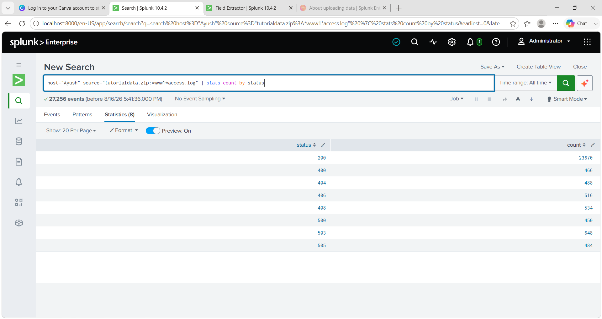
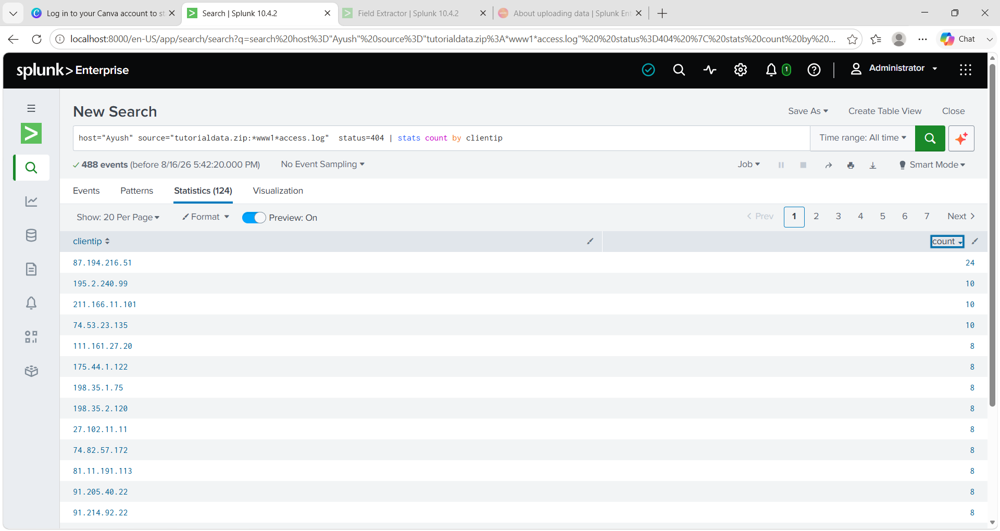
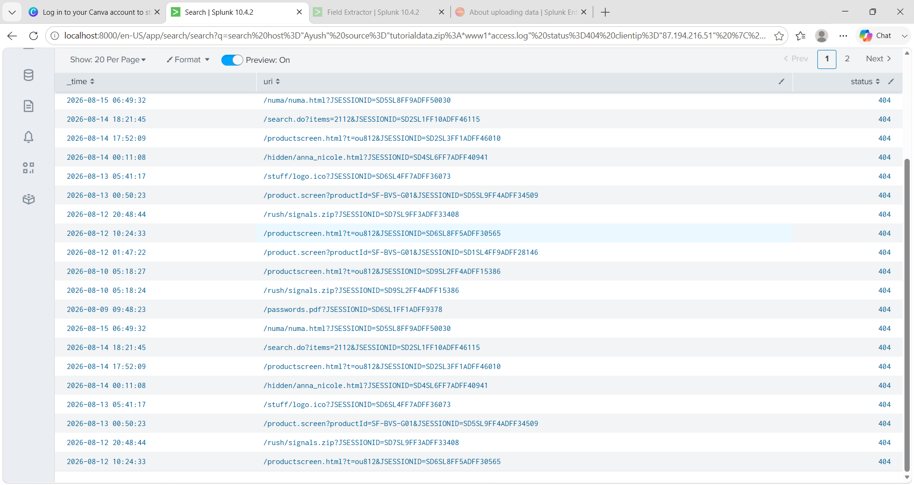

# Splunk Log Analysis — Suspicious 404 Activity Investigation

**Tool:** Splunk Enterprise Free (local instance)
**Dataset:** Splunk's official tutorial dataset (`tutorialdata.zip`) — web server access logs
**Goal:** Practice SPL-based log analysis and alert triage reasoning on realistic HTTP access log data.

---

## 1. Objective

Analyze web server access logs to identify anomalous client behavior — specifically, clients generating a high number of "page not found" (HTTP 404) errors, which can indicate automated scanning or forced-browsing/directory enumeration activity.

---

## 2. Step 1 — Baseline: HTTP Status Code Distribution

**Query:**
```spl
host="Ayush" source="tutorialdata.zip:*www1*access.log" | stats count by status
```

**Result:**

| Status | Count |
|--------|-------|
| 200 (OK) | 23,670 |
| 400 | 466 |
| 404 | 488 |
| 406 | 516 |
| 408 | 534 |
| 500 | 450 |
| 503 | 648 |
| 505 | 484 |



**Observation:** The vast majority of traffic (23,670 events) returns successful `200` responses. `404` errors account for 488 events out of 27,256 total — roughly 1.8% of traffic. This is the segment worth investigating further, since 404s can indicate either broken links (benign) or reconnaissance activity (malicious).

---

## 3. Step 2 — Isolate and Rank 404s by Source IP

**Query:**
```spl
host="Ayush" source="tutorialdata.zip:*www1*access.log" status=404 | stats count by clientip
```

Sorted descending by count.

**Result (top entries):**

| Client IP | 404 Count |
|-----------|-----------|
| 87.194.216.51 | **24** |
| 195.2.240.99 | 10 |
| 211.166.11.101 | 10 |
| 74.53.23.135 | 10 |
| (remaining ~120 IPs) | 2–8 each |



**Observation:** 488 total 404s are spread across 124 unique IPs. Most IPs sit in the 2–10 range, consistent with normal scattered browsing noise. One IP, `87.194.216.51`, stands out with 24 hits — roughly 2.4x the next-highest count.

**Initial read:** volume alone (24 hits) is not dramatic in absolute terms and would not, by itself, justify escalation. The next step is to check *what* this IP was actually requesting — content matters more than volume when triaging low-volume alerts.

---

## 4. Step 3 — Drill Into the Suspicious IP's Requests

**Query:**
```spl
host="Ayush" source="tutorialdata.zip:*www1*access.log" status=404 clientip="87.194.216.51" | table _time, uri, status
```

**Result (sample of requested URIs):**

```
/numa/numa.html?JSESSIONID=...
/search.do?items=2112&JSESSIONID=...
/productscreen.html?t=ou812&JSESSIONID=...
/hidden/anna_nicole.html?JSESSIONID=...
/stuff/logo.ico?JSESSIONID=...
/product.screen?productId=SF-BVS-G01&JSESSIONID=...
/rush/signals.zip?JSESSIONID=...
/passwords.pdf?JSESSIONID=...
```



**Observation:** Requests are a mix of two categories:

1. **Normal-looking navigation** — `/product.screen`, `/productscreen.html`, `/search.do` — consistent with legitimate e-commerce browsing.
2. **Anomalous paths** — `/passwords.pdf`, `/hidden/anna_nicole.html`, `/rush/signals.zip` — these are not paths a real user would reach by clicking links on the site. Filenames like `passwords.pdf` and directories named `hidden` are classic guesses used in **forced-browsing / directory enumeration**, where an attacker or scanner probes for sensitive or hidden files by guessing common names.

Timestamps for these requests span **August 9–15** (a 6-day window), not a tight burst — this is more consistent with slow, low-and-slow probing (possibly to avoid basic rate-based detection) than an automated tool hammering the server in seconds. It could also be a bot/crawler hitting stale/broken links; the data alone doesn't fully distinguish between the two.

---

## 5. Finding & Recommendation

**Finding:**
Client IP `87.194.216.51` generated 24 HTTP 404 errors over a 6-day period against the monitored web server. While request volume was low relative to total traffic, URI-level analysis revealed a subset of requests for atypical, sensitive-sounding filenames (`passwords.pdf`, `/hidden/anna_nicole.html`) interspersed with normal site navigation. This pattern is consistent with low-effort forced-browsing/reconnaissance activity rather than random broken links.

**Recommended next steps (as would be done in a real SOC workflow):**
1. Check whether `87.194.216.51` has any **200 (successful)** responses — did any of its probing attempts actually succeed?
2. Cross-reference the IP against threat intelligence feeds / IP reputation databases.
3. Check for repeat 404/probing behavior from the same IP across other time windows or other hosts.
4. If pattern is confirmed elsewhere, consider a detection rule: alert when a single source IP generates 404s against more than N distinct "sensitive-sounding" paths within a rolling time window.

---

## 6. Key Takeaway (Lessons Learned)

Initial triage based on **volume alone** suggested this IP wasn't significant (24 hits is a small number). Only after examining the **actual content of the requests** (the URIs themselves) did a meaningful pattern emerge. This reinforced a core SOC analyst principle: **low-volume alerts should not be dismissed without checking what was actually requested/attempted** — count is a starting filter, not a verdict.

---

## Tools & Skills Demonstrated
- Splunk SPL: `stats count by`, `table`, field filtering, wildcard source matching
- Log source troubleshooting (resolved backslash-escaping issue in Splunk source path matching)
- Alert triage reasoning: baseline → anomaly detection → drill-down → judgment call
- Security-relevant pattern recognition (forced browsing / directory enumeration)
